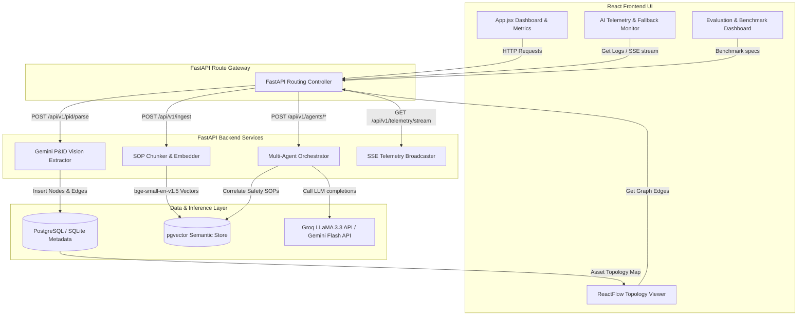
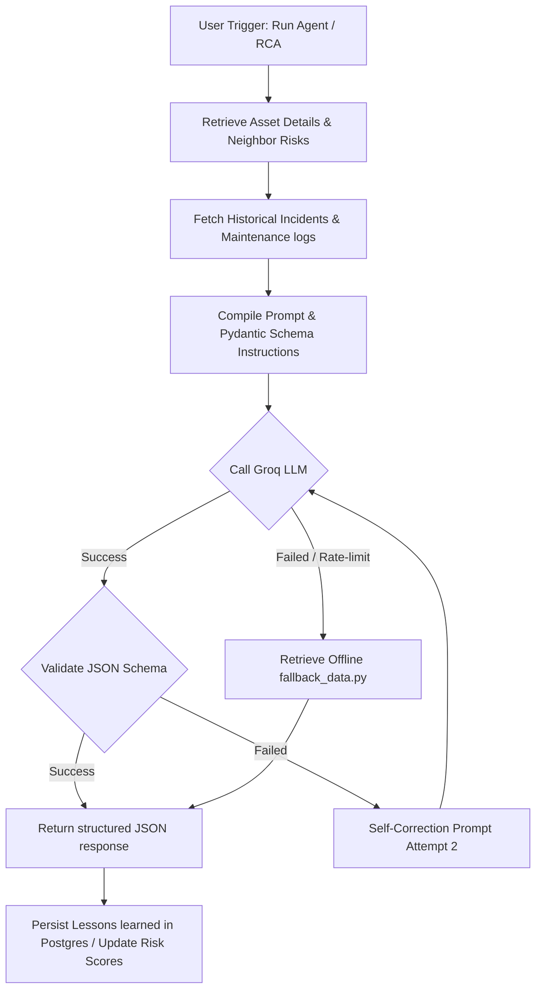
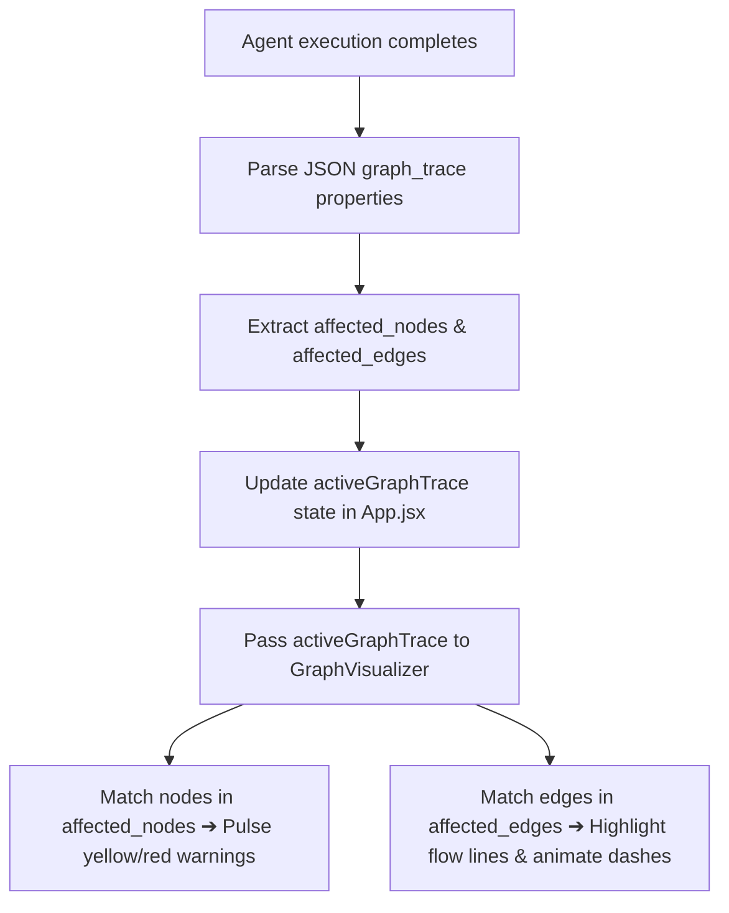
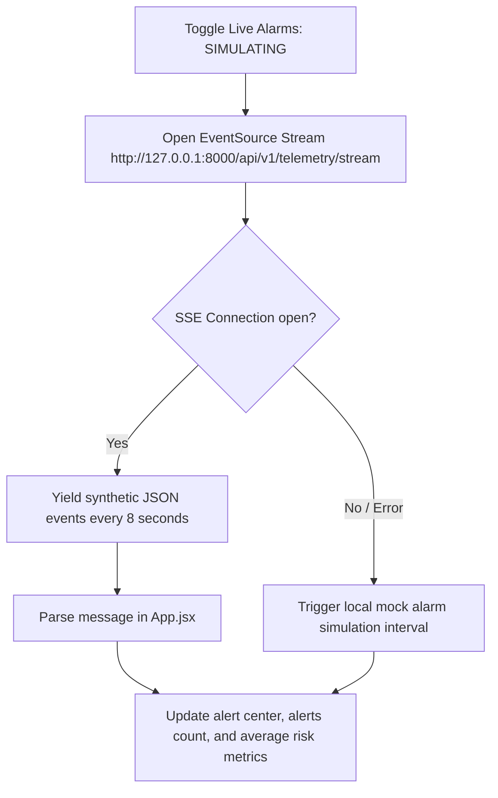

# OpsBrain AI: System Architecture & Data Flow Diagrams

This document contains Mermaid diagrams illustrating the backend components, multi-agent frameworks, telemetry streams, and logical flows for **OpsBrain AI** (v1.2).

---

## 1. System Architecture

---

## 2. Multi-Agent Reasoning Flow

---

## 3. Graph Trace Visualization Flow

---

## 4. Telemetry SSE Stream Flow

